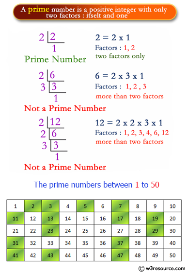
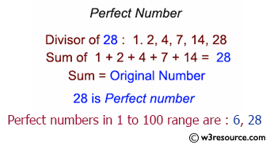

# DiscreteMathProject
**Discrete Mathematics Project, First Year - Dept. of Computer Science.**

# Project 1, Prime Numbers
**A program in C# Sharp to find the prime numbers within a range of numbers.**

# Project 2, Perfect Numbers
**A C# Sharp Program to find the perfect numbers within a given range of number.**

